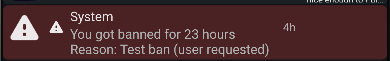

# Note
- You are expected to know how to use the [Parse SDK](https://docs.parseplatform.org/js/guide/).
- Every "you" or "you're" etc. references to the <a href="#user-authorized">logged in user</a>.
- Guest accounts (users where `emailVerified` is `false`) may not be able to access all functions.
- Updated for 1.20.0 (app version 100)

# Config
The config contains the following properties (inside `params`):
<table>
  <tr>
    <th>Name</th>
    <th>Value</th>
    <th>Description</th>
  </tr>
  <tr>
    <td>categories</td>
    <td>Array: <a href="#category">Category</a></td>
    <td>Contains the categories</td>
  </tr>
  <tr>
    <td>contributors</td>
    <td>Array: <a href="#contributor">Contributor</a></td>
    <td>Contains the app contributors</td>
  </tr>
  <tr>
    <td>discord_link</td>
    <td>String</td>
    <td>The eFur Discord link</td>
  </tr>
  <tr>
    <td>github_link</td>
    <td>String</td>
    <td>The eFur GitHub link</td>
  </tr>
  <tr>
    <td>support_id</td>
    <td>String</td>
    <td>User ID for support questions</td>
  </tr>
  <tr>
    <td>telegram_link</td>
    <td>String</td>
    <td>The eFur Telegram link</td>
  </tr>
  <tr>
    <td>translation_link</td>
    <td>String</td>
    <td>The link on where to help translate the app</td>
  </tr>
  <tr>
    <td>website_base_url</td>
    <td>String</td>
    <td>The base URL of the website</td>
  </tr>
</table>

# Ratings
`0`: Safe  
`1`: Suggestive  
`2`: Explicit

# Functions: `Parse.Cloud.run(...)`
## Register account: `registerUser`
Keep in mind that to run this function, you need to be logged in with a **guest** account.  
Request (`JSON`):
<table>
  <tr>
    <th>Name</th>
    <th>Value</th>
    <th>Description</th>
  </tr>
  <tr>
    <td>a</td>
    <td>Integer (min=0, max=1)</td>
    <td>Wether or not the user is 16 years or older</td>
  </tr>
  <tr>
    <td>e</td>
    <td>String</td>
    <td>Email</td>
  </tr>
  <tr>
    <td>p</td>
    <td>String</td>
    <td>Password</td>
  </tr>
  <tr>
    <td>u</td>
    <td>String</td>
    <td>Username. In the app it's a random string.</td>
  </tr>
  <tr>
    <td>z</td>
    <td>Integer</td>
    <td>App version</td>
  </tr>
</table>

Response (`Boolean`): True if the account has been created successfully

## Get posts in New: `getNewPosts`
Request (`JSON`):
<table>
  <tr>
    <th>Name</th>
    <th>Value</th>
    <th>Description</th>
  </tr>
  <tr>
    <td>d</td>
    <td>Integer (optional)</td>
    <td>Timestamp of last post. Used to load more posts.</td>
  </tr>
  <tr>
    <td>r</td>
    <td>Integer</td>
    <td>The maximum <a href="#ratings">rating</a> to search for posts</td>
  </tr>
  <tr>
    <td>z</td>
    <td>Integer</td>
    <td>App version</td>
  </tr>
</table>

Response (`JSON`):
<table>
  <tr>
    <th>Name</th>
    <th>Value</th>
    <th>Description</th>
  </tr>
  <tr>
    <td>f</td>
    <td>Array (length=[0..8]): String</td>
    <td>IDs of favorited posts</td>
  </tr>
  <tr>
    <td>p</td>
    <td>Array (length=8): <a href="#post">Post</a></td>
    <td>Posts</td>
  </tr>
</table>

## Get post by ID: `getSinglePost`
Request (`JSON`):
<table>
  <tr>
    <th>Name</th>
    <th>Value</th>
    <th>Description</th>
  </tr>
  <tr>
    <td>d</td>
    <td>Integer (optional)</td>
    <td>Current timestamp(?), unknown what it's used for</td>
  </tr>
  <tr>
    <td>p</td>
    <td>String</td>
    <td>Post ID</td>
  </tr>
  <tr>
    <td>r</td>
    <td>Integer</td>
    <td>The maximum <a href="#ratings">rating</a> to search for posts</td>
  </tr>
  <tr>
    <td>z</td>
    <td>Integer</td>
    <td>App version</td>
  </tr>
</table>

Response (`JSON`):
<table>
  <tr>
    <th>Name</th>
    <th>Value</th>
    <th>Description</th>
  </tr>
  <tr>
    <td>f</td>
    <td>Array (length=[0..1]): String</td>
    <td>IDs of favorited posts</td>
  </tr>
  <tr>
    <td>p</td>
    <td>Array (length=1): <a href="#post">Post</a></td>
    <td>Posts</td>
  </tr>
</table>

## Get notifications: `getNotifications`
Note that calling this function does not reset the notification count. To do that, combine this function with [resetNotificationCount](#reset-notification-count-resetnotificationcount).  
Request (`JSON`):
<table>
  <tr>
    <th>Name</th>
    <th>Value</th>
    <th>Description</th>
  </tr>
  <tr>
    <td>d</td>
    <td>Integer (optional)</td>
    <td>Timestamp of last notification. Used to load more notifications.</td>
  </tr>
  <tr>
    <td>z</td>
    <td>Integer</td>
    <td>App version</td>
  </tr>
</table>

Response (<code>Array (length=[0..40]): <a href="#notification">Notification</a></code>): (At most) 40 notifications

## Get user settings: `getUserSettings`
Request (`JSON`):
<table>
  <tr>
    <th>Name</th>
    <th>Value</th>
    <th>Description</th>
  </tr>
  <tr>
    <td>z</td>
    <td>Integer</td>
    <td>App version</td>
  </tr>
</table>

Response (`JSON`):
<table>
  <tr>
    <th>Name</th>
    <th>Value</th>
    <th>Description</th>
  </tr>
  <tr>
    <td>a</td>
    <td>Boolean</td>
    <td>Unknown</td>
  </tr>
  <tr>
    <td>b</td>
    <td>Boolean</td>
    <td>Unknown</td>
  </tr>
  <tr>
    <td>bs</td>
    <td>Array: ?</td>
    <td>Unknown</td>
  </tr>
  <tr>
    <td>sb</td>
    <td>Integer</td>
    <td>Unknown</td>
  </tr>
  <tr>
    <td>sc</td>
    <td>Integer</td>
    <td>Unknown</td>
  </tr>
</table>

## Count unread messages: `countUnreadConversations`
Request (`JSON`):
<table>
  <tr>
    <th>Name</th>
    <th>Value</th>
    <th>Description</th>
  </tr>
  <tr>
    <td>z</td>
    <td>Integer</td>
    <td>App version</td>
  </tr>
</table>

Response (`Integer`): Amount of unread messages

## Count unseen posts from following: `getFollowingPostCount`
Request (`JSON`):
<table>
  <tr>
    <th>Name</th>
    <th>Value</th>
    <th>Description</th>
  </tr>
  <tr>
    <td>z</td>
    <td>Integer</td>
    <td>App version</td>
  </tr>
</table>

Response (`Integer`): Amount of unseen posts

## Count unseen notifications: `getNotificationCount`
Request (`JSON`):
<table>
  <tr>
    <th>Name</th>
    <th>Value</th>
    <th>Description</th>
  </tr>
  <tr>
    <td>z</td>
    <td>Integer</td>
    <td>App version</td>
  </tr>
</table>

Response (`Integer`): Amount of unseen notifications

## Get user profile: `getUserProfile`
Request (`JSON`):
<table>
  <tr>
    <th>Name</th>
    <th>Value</th>
    <th>Description</th>
  </tr>
  <tr>
    <td>u</td>
    <td>String</td>
    <td>User ID</td>
  </tr>
  <tr>
    <td>z</td>
    <td>Integer</td>
    <td>App version</td>
  </tr>
</table>

Response (`JSON`):
<table>
  <tr>
    <th>Name</th>
    <th>Value</th>
    <th>Description</th>
  </tr>
  <tr>
    <td>a</td>
    <td><a href="#image">Image</a></td>
    <td>Icon</td>
  </tr>
  <tr>
    <td>ab</td>
    <td>Boolean</td>
    <td>Wether the user is a moderator</td>
  </tr>
  <tr>
    <td>b</td>
    <td><a href="#image">Image</a></td>
    <td>Background</td>
  </tr>
  <tr>
    <td>c</td>
    <td>Integer</td>
    <td>How many users the user is following</td>
  </tr>
  <tr>
    <td>d</td>
    <td>Integer</td>
    <td>How many followers the user has</td>
  </tr>
  <tr>
    <td>e</td>
    <td>Integer</td>
    <td>How many posts the user has favorited</td>
  </tr>
  <tr>
    <td>f</td>
    <td>Integer</td>
    <td>How many comments the user has written</td>
  </tr>
  <tr>
    <td>g</td>
    <td>Boolean</td>
    <td>Wether you're following the user</td>
  </tr>
  <tr>
    <td>h</td>
    <td>Integer</td>
    <td>How many posts the user has created</td>
  </tr>
  <tr>
    <td>ia</td>
    <td>Array (length=3): <a href="#user">User</a></td>
    <td>The last 3 users that the user followed, used for thumbnails</td>
  </tr>
  <tr>
    <td>ib</td>
    <td>Array (length=3): <a href="#user">User</a></td>
    <td>The last 3 followers of the user, used for thumbnails</td>
  </tr>
  <tr>
    <td>ja</td>
    <td>Integer</td>
    <td>Timestamp until user is unbanned, only given if the user is banned</td>
  </tr>
  <tr>
    <td>jb</td>
    <td>String</td>
    <td>Ban reason, only given if the user is banned</td>
  </tr>
  <tr>
    <td>s</td>
    <td>Integer</td>
    <td>Date of user creation</td>
  </tr>
  <tr>
    <td>u</td>
    <td>String</td>
    <td>Username</td>
  </tr>
</table>

## See who favorited a post: `getPostFavedBy`
Request (`JSON`):
<table>
  <tr>
    <th>Name</th>
    <th>Value</th>
    <th>Description</th>
  </tr>
  <tr>
    <td>p</td>
    <td>String</td>
    <td>Post ID</td>
  </tr>
  <tr>
    <td>z</td>
    <td>Integer</td>
    <td>App version</td>
  </tr>
</table>

Response (<code>Array: <a href="#favourite">Favourite</a></code>): The favorites

## (Un)favorite a post: `favPost`
Request (`JSON`):
<table>
  <tr>
    <th>Name</th>
    <th>Value</th>
    <th>Description</th>
  </tr>
  <tr>
    <td>a</td>
    <td>Boolean</td>
    <td>Wether to favorite or unfavorite</td>
  </tr>
  <tr>
    <td>p</td>
    <td>String</td>
    <td>Post ID</td>
  </tr>
  <tr>
    <td>z</td>
    <td>Integer</td>
    <td>App version</td>
  </tr>
</table>

Response (`JSON`):
<table>
  <tr>
    <th>Name</th>
    <th>Value</th>
    <th>Description</th>
  </tr>
  <tr>
    <td>f</td>
    <td>Integer</td>
    <td>New favorite count (how many favorites the post has)</td>
  </tr>
  <tr>
    <td>g</td>
    <td>Boolean</td>
    <td>New favorite state (wether the user has favorited the post)</td>
  </tr>
</table>

## Get comments on post: `getComments`
Request (`JSON`):
<table>
  <tr>
    <th>Name</th>
    <th>Value</th>
    <th>Description</th>
  </tr>
  <tr>
    <td>d</td>
    <td>Integer</td>
    <td>Timestamp of last comment. Used to load more comments.</td>
  </tr>
  <tr>
    <td>c</td>
    <td>String</td>
    <td>ID of parent comment. Used to get replies.</td>
  </tr>
  <tr>
    <td>p</td>
    <td>String</td>
    <td>Post ID</td>
  </tr>
  <tr>
    <td>z</td>
    <td>Integer</td>
    <td>App version</td>
  </tr>
</table>

Response (`JSON`):
<table>
  <tr>
    <th>Name</th>
    <th>Value</th>
    <th>Description</th>
  </tr>
  <tr>
    <td>c</td>
    <td>Array: <a href="#comment">Comment</a></td>
    <td>Comments</td>
  </tr>
  <tr>
    <td>f</td>
    <td>Array: String</td>
    <td>IDs of liked comments</td>
  </tr>
</table>

# Objects
## Post
There are different types of posts. To see which one you need, check the `v` property of the Post object.
### Image post (0)
<table>
  <tr>
    <th>Name</th>
    <th>Value</th>
    <th>Description</th>
  </tr>
  <tr>
    <td>a</td>
    <td>Integer</td>
    <td>Width of the image</td>
  </tr>
  <tr>
    <td>b</td>
    <td>Integer</td>
    <td>Height of the image</td>
  </tr>
  <tr>
    <td>c</td>
    <td>Array (length=[0..3]): Integer</td>
    <td>An array containing maximum 3 category indexes (see <a href="#config">Config</a>)</td>
  </tr>
  <tr>
    <td>data</td>
    <td><a href="#image">Image</a></td>
    <td>The image</td>
  </tr>
  <tr>
    <td>f</td>
    <td>String</td>
    <td>The title</td>
  </tr>
  <tr>
    <td>i</td>
    <td>String</td>
    <td>The description</td>
  </tr>
  <tr>
    <td>e</td>
    <td>String</td>
    <td>The artist / copyright holder</td>
  </tr>
  <tr>
    <td>s</td>
    <td>String</td>
    <td>The source URL</td>
  </tr>
  <tr>
    <td>k</td>
    <td>Integer</td>
    <td>The amount of favorites the post currently has</td>
  </tr>
  <tr>
    <td>j</td>
    <td>Integer</td>
    <td>The amount of comments the post currently has</td>
  </tr>
  <tr>
    <td>l</td>
    <td>Boolean</td>
    <td>Unknown, appears to be false</td>
  </tr>
  <tr>
    <td>r</td>
    <td>Integer</td>
    <td>The <a href="#ratings">rating</a> of the post</td>
  </tr>
  <tr>
    <td>t</td>
    <td>Array (length=[0..100]): String</td>
    <td>An array containing maximum 100 tags</td>
  </tr>
  <tr>
    <td>u</td>
    <td><a href="#user">User</a></td>
    <td>The creator of the post</td>
  </tr>
  <tr>
    <td>v</td>
    <td>Integer</td>
    <td>The type of post, in this case 0</td>
  </tr>
  <tr>
    <td>y</td>
    <td>Integer</td>
    <td>Unknown</td>
  </tr>
  <tr>
    <td>x</td>
    <td>Boolean</td>
    <td>Wether the post is hidden</td>
  </tr>
  <tr>
    <td>z</td>
    <td>Boolean</td>
    <td>Wether the app prevents the user from downloading the image. This can however be circumvented.</td>
  </tr>
</table>

### Story post (1)
<table>
  <tr>
    <th>Name</th>
    <th>Value</th>
    <th>Description</th>
  </tr>
  <tr>
    <td>c</td>
    <td>Array (length=[0..3]): Integer</td>
    <td>An array containing maximum 3 category indexes (see <a href="#config">Config</a>)</td>
  </tr>
  <tr>
    <td>data</td>
    <td><a href="#text">Text</a></td>
    <td>The full text (for if the text is too long)</td>
  </tr>
  <tr>
    <td>f</td>
    <td>String</td>
    <td>The title</td>
  </tr>
  <tr>
    <td>g</td>
    <td>String</td>
    <td>The content (might be trimmed if too large, use <code>data</code> for full text)</td>
  </tr>
  <tr>
    <td>i</td>
    <td>String</td>
    <td>The description</td>
  </tr>
  <tr>
    <td>e</td>
    <td>String</td>
    <td>The artist / copyright holder</td>
  </tr>
  <tr>
    <td>s</td>
    <td>String</td>
    <td>The source URL</td>
  </tr>
  <tr>
    <td>k</td>
    <td>Integer</td>
    <td>The amount of favorites the post currently has</td>
  </tr>
  <tr>
    <td>j</td>
    <td>Integer</td>
    <td>The amount of comments the post currently has</td>
  </tr>
  <tr>
    <td>l</td>
    <td>Boolean</td>
    <td>Unknown, appears to be false</td>
  </tr>
  <tr>
    <td>r</td>
    <td>Integer</td>
    <td>The <a href="#ratings">rating</a> of the post</td>
  </tr>
  <tr>
    <td>t</td>
    <td>Array (length=[0..100]): String</td>
    <td>An array containing maximum 100 tags</td>
  </tr>
  <tr>
    <td>u</td>
    <td><a href="#user">User</a></td>
    <td>The creator of the post</td>
  </tr>
  <tr>
    <td>v</td>
    <td>Integer</td>
    <td>The type of post, in this case 1</td>
  </tr>
  <tr>
    <td>y</td>
    <td>Integer</td>
    <td>Unknown</td>
  </tr>
  <tr>
    <td>x</td>
    <td>Boolean</td>
    <td>Wether the post is hidden</td>
  </tr>
</table>

### Poll post (3)

<table>
  <tr>
    <th>Name</th>
    <th>Value</th>
    <th>Description</th>
  </tr>
  <tr>
    <td>c</td>
    <td>Array (length=[0..3]): Integer</td>
    <td>An array containing maximum 3 category indexes (see <a href="#config">Config</a>)</td>
  </tr>
  <tr>
    <td>i</td>
    <td>String</td>
    <td>The description</td>
  </tr>
  <tr>
    <td>e</td>
    <td>String</td>
    <td>The artist / copyright holder</td>
  </tr>
  <tr>
    <td>s</td>
    <td>String</td>
    <td>The source URL</td>
  </tr>
  <tr>
    <td>k</td>
    <td>Integer</td>
    <td>The amount of favorites the post currently has</td>
  </tr>
  <tr>
    <td>j</td>
    <td>Integer</td>
    <td>The amount of comments the post currently has</td>
  </tr>
  <tr>
    <td>l</td>
    <td>Boolean</td>
    <td>Unknown, appears to be false</td>
  </tr>
  <tr>
    <td>p</td>
    <td><a href="#poll">Poll</a></td>
    <td>The poll which includes the question/title</td>
  </tr>
  <tr>
    <td>r</td>
    <td>Integer</td>
    <td>The <a href="#ratings">rating</a> of the post</td>
  </tr>
  <tr>
    <td>t</td>
    <td>Array (length=[0..100]): String</td>
    <td>An array containing maximum 100 tags</td>
  </tr>
  <tr>
    <td>u</td>
    <td><a href="#user">User</a></td>
    <td>The creator of the post</td>
  </tr>
  <tr>
    <td>v</td>
    <td>Integer</td>
    <td>The type of post, in this case 3</td>
  </tr>
  <tr>
    <td>y</td>
    <td>Integer</td>
    <td>Unknown</td>
  </tr>
  <tr>
    <td>x</td>
    <td>Boolean</td>
    <td>Wether the post is hidden</td>
  </tr>
</table>

## Category
<table>
  <tr>
    <th>Name</th>
    <th>Value</th>
    <th>Description</th>
  </tr>
  <tr>
    <td>i</td>
    <td>Integer</td>
    <td>Index</td>
  </tr>
  <tr>
    <td>n</td>
    <td>String</td>
    <td>Name</td>
  </tr>
</table>

## Contributor
<table>
  <tr>
    <th>Name</th>
    <th>Value</th>
    <th>Description</th>
  </tr>
  <tr>
    <td>t</td>
    <td>Integer</td>
    <td>Unknown</td>
  </tr>
  <tr>
    <td>u</td>
    <td>String</td>
    <td>User ID</td>
  </tr>
  <tr>
    <td>w</td>
    <td>String</td>
    <td>The title of contribution</td>
  </tr>
</table>

## User
<table>
  <tr>
    <th>Name</th>
    <th>Value</th>
    <th>Description</th>
  </tr>
  <tr>
    <td>b</td>
    <td><a href="#image">Image</a></td>
    <td>Background</td>
  </tr>
  <tr>
    <td>i</td>
    <td><a href="#image">Image</a></td>
    <td>Icon</td>
  </tr>
  <tr>
    <td>ul</td>
    <td>String</td>
    <td>Username in lower case. Used for searching for users by name (case insensitive)</td>
  </tr>
  <tr>
    <td>username</td>
    <td>String</td>
    <td>Username</td>
  </tr>
</table>

## User (authorized)
The password is never stored nor retrieved in plain text. It is hashed beforehand.
<table>
  <tr>
    <th>Name</th>
    <th>Value</th>
    <th>Description</th>
  </tr>
  <tr>
    <td>a</td>
    <td>Integer</td>
    <td>Unknown, but probably 1 if the user is allowed to turn off SFW mode</td>
  </tr>
  <tr>
    <td>email</td>
    <td>String</td>
    <td>Email</td>
  </tr>
  <tr>
    <td>emailVerified</td>
    <td>Boolean</td>
    <td>Wether the email has been verified</td>
  </tr>
  <tr>
    <td>b</td>
    <td><a href="#image">Image</a></td>
    <td>Background</td>
  </tr>
  <tr>
    <td>i</td>
    <td><a href="#image">Image</a></td>
    <td>Icon</td>
  </tr>
  <tr>
    <td>ul</td>
    <td>String</td>
    <td>Username in lower case. Used for searching for users by name (case insensitive)</td>
  </tr>
  <tr>
    <td>username</td>
    <td>String</td>
    <td>Username</td>
  </tr>
</table>

## Notification
There are different types of notifications. To see which one you need, check the `t` property of the Notification object.
### Favorited (0)
> **username**  
 Favourited your image

> **username**  
 Favourited your text post

> **username**  
 Favourited your poll
<table>
  <tr>
    <th>Name</th>
    <th>Value</th>
    <th>Description</th>
  </tr>
  <tr>
    <td>a</td>
    <td>Boolean</td>
    <td>Unknown as of right now, appears to be true</td>
  </tr>
  <tr>
    <td>f</td>
    <td><a href="#user">User</a></td>
    <td>The user that favorited the post</td>
  </tr>
  <tr>
    <td>p</td>
    <td><a href="#post">Post</a></td>
    <td>The post that was favorited</td>
  </tr>
  <tr>
    <td>t</td>
    <td>Integer</td>
    <td>Type of notification, in this case 0</td>
  </tr>
</table>

### (Un)followed (1)
Check `a` to know if the user followed or unfollowed you.
> **username**  
> Followed you

> **ID**  
> Someone unfollowed you
<table>
  <tr>
    <th>Name</th>
    <th>Value</th>
    <th>Description</th>
  </tr>
  <tr>
    <td>a</td>
    <td>Boolean</td>
    <td>True when the user followed you, false when the user unfollowed you</td>
  </tr>
  <tr>
    <td>f</td>
    <td><a href="#user">User</a></td>
    <td>The user that (un)followed</td>
  </tr>
  <tr>
    <td>t</td>
    <td>Integer</td>
    <td>Type of notification, in this case 1</td>
  </tr>
</table>

### Commented (2)
> **username**  
> Commented: **content**
<table>
  <tr>
    <th>Name</th>
    <th>Value</th>
    <th>Description</th>
  </tr>
  <tr>
    <td>a</td>
    <td>Boolean</td>
    <td>Unknown as of right now, appears to be true</td>
  </tr>
  <tr>
    <td>c</td>
    <td><a href="#comment">Comment</a></td>
    <td>The comment</td>
  </tr>
  <tr>
    <td>f</td>
    <td><a href="#user">User</a></td>
    <td>The user that commented</td>
  </tr>
  <tr>
    <td>p</td>
    <td><a href="#post">Post</a></td>
    <td>The post that was commented on</td>
  </tr>
  <tr>
    <td>t</td>
    <td>Integer</td>
    <td>Type of notification, in this case 2</td>
  </tr>
</table>

### Replied (3)
> **username**  
> Replied: **content**
<table>
  <tr>
    <th>Name</th>
    <th>Value</th>
    <th>Description</th>
  </tr>
  <tr>
    <td>a</td>
    <td>Boolean</td>
    <td>Unknown as of right now, appears to be true</td>
  </tr>
  <tr>
    <td>c</td>
    <td><a href="#comment">Comment</a></td>
    <td>The comment</td>
  </tr>
  <tr>
    <td>e</td>
    <td>Parse Pointer</td>
    <td>A pointer with an ID to the replied comment</td>
  </tr>
  <tr>
    <td>f</td>
    <td><a href="#user">User</a></td>
    <td>The user that commented</td>
  </tr>
  <tr>
    <td>p</td>
    <td><a href="#post">Post</a></td>
    <td>The post that was commented on</td>
  </tr>
  <tr>
    <td>t</td>
    <td>Integer</td>
    <td>Type of notification, in this case 3</td>
  </tr>
</table>

### Mentioned (5)
> **username**  
> Mentioned you in a post
<table>
  <tr>
    <th>Name</th>
    <th>Value</th>
    <th>Description</th>
  </tr>
  <tr>
    <td>a</td>
    <td>Boolean</td>
    <td>Unknown as of right now, appears to be true</td>
  </tr>
  <tr>
    <td>f</td>
    <td><a href="#user">User</a></td>
    <td>The user that mentioned you</td>
  </tr>
  <tr>
    <td>p</td>
    <td><a href="#post">Post</a></td>
    <td>The post in which you were mentioned</td>
  </tr>
  <tr>
    <td>t</td>
    <td>Integer</td>
    <td>Type of notification, in this case 5</td>
  </tr>
</table>

### Banned (100)
Old:
> System  
> You got banned for **time**  
> Reason: **reason**
New:
> eFur  
> You got banned for **time**  
> Reason: **reason**

<table>
  <tr>
    <th>Name</th>
    <th>Value</th>
    <th>Description</th>
  </tr>
  <tr>
    <td>a</td>
    <td>Boolean</td>
    <td>Unknown as of right now, appears to be true</td>
  </tr>
  <tr>
    <td>d</td>
    <td>Integer</td>
    <td>Timestamp for when you are unbanned</td>
  </tr>
  <tr>
    <td>r</td>
    <td>String</td>
    <td>Ban reason</td>
  </tr>
  <tr>
    <td>t</td>
    <td>Integer</td>
    <td>Type of notification, in this case 100</td>
  </tr>
</table>

### Unbanned (101)
> eFur  
> You got unbanned
<table>
  <tr>
    <th>Name</th>
    <th>Value</th>
    <th>Description</th>
  </tr>
  <tr>
    <td>a</td>
    <td>Boolean</td>
    <td>Unknown as of right now, appears to be true</td>
  </tr>
  <tr>
    <td>d</td>
    <td>Integer</td>
    <td>Timestamp for when you were initially going to be unbanned</td>
  </tr>
  <tr>
    <td>t</td>
    <td>Integer</td>
    <td>Type of notification, in this case 101</td>
  </tr>
</table>

## Comment
<table>
  <tr>
    <th>Name</th>
    <th>Value</th>
    <th>Description</th>
  </tr>
  <tr>
    <td>c</td>
    <td>Parse Pointer</td>
    <td>Pointer to the parent comment, or undefined if the comment is not a reply</td>
  </tr>
  <tr>
    <td>p</td>
    <td>Parse Pointer</td>
    <td>Pointer to the parent post</td>
  </tr>
  <tr>
    <td>s</td>
    <td>Integer</td>
    <td>How many likes the comment has</td>
  </tr>
  <tr>
    <td>q</td>
    <td>Integer</td>
    <td>How many replies the comment has</td>
  </tr>
  <tr>
    <td>t</td>
    <td>String</td>
    <td>The content of the comment</td>
  </tr>
  <tr>
    <td>u</td>
    <td>Parse Pointer</td>
    <td>Pointer to the user who commented</td>
  </tr>
</table>

## Image
Note that this may include GIFs.
<table>
  <tr>
    <th>Name</th>
    <th>Value</th>
    <th>Description</th>
  </tr>
  <tr>
    <td>f</td>
    <td>String</td>
    <td>URL to the full image</td>
  </tr>
  <tr>
    <td>p</td>
    <td>String</td>
    <td>URL to the preview image (lower quality). Used by the app in the New section.</td>
  </tr>
  <tr>
    <td>t</td>
    <td>String</td>
    <td>URL to the thumbnail image (lowest quality). Used by the app in the user posts section.</td>
  </tr>
</table>

## Text
<table>
  <tr>
    <th>Name</th>
    <th>Value</th>
    <th>Description</th>
  </tr>
  <tr>
    <td>f</td>
    <td>String</td>
    <td>URL to the full text</td>
  </tr>
</table>

## Video
<table>
  <tr>
    <th>Name</th>
    <th>Value</th>
    <th>Description</th>
  </tr>
  <tr>
    <td>f</td>
    <td>String</td>
    <td>URL to the full video cover</td>
  </tr>
  <tr>
    <td>p</td>
    <td>String</td>
    <td>URL to the preview video cover (lower quality). Used by the app in the New section.</td>
  </tr>
  <tr>
    <td>t</td>
    <td>String</td>
    <td>URL to the thumbnail video cover (lowest quality). Used by the app in the user posts section.</td>
  </tr>
  <tr>
    <td>v</td>
    <td>String</td>
    <td>URL to the video</td>
  </tr>
</table>

## Poll
<table>
  <tr>
    <th>Name</th>
    <th>Value</th>
    <th>Description</th>
  </tr>
  <tr>
    <td>o</td>
    <td>Array (length=[2..10]): String</td>
    <td>The options to choose from in the poll</td>
  </tr>
  <tr>
    <td>q</td>
    <td>String</td>
    <td>The question</td>
  </tr>
  <tr>
    <td>s</td>
    <td>String</td>
    <td>The amount of people that voted</td>
  </tr>
  <tr>
    <td>s0</code></td>
    <td>String</td>
    <td>The amount of votes that option 0 currently has</td>
  </tr>
  <tr>
    <td>s1</code></td>
    <td>String</td>
    <td>The amount of votes that option 1 currently has</td>
  </tr>
  <tr>
    <td>s2</code></td>
    <td>String</td>
    <td>The amount of votes that option 2 currently has</td>
  </tr>
  <tr>
    <td>s3</code></td>
    <td>String</td>
    <td>The amount of votes that option 3 currently has</td>
  </tr>
  <tr>
    <td>s4</code></td>
    <td>String</td>
    <td>The amount of votes that option 4 currently has</td>
  </tr>
  <tr>
    <td>s5</code></td>
    <td>String</td>
    <td>The amount of votes that option 5 currently has</td>
  </tr>
  <tr>
    <td>s6</code></td>
    <td>String</td>
    <td>The amount of votes that option 6 currently has</td>
  </tr>
  <tr>
    <td>s7</code></td>
    <td>String</td>
    <td>The amount of votes that option 7 currently has</td>
  </tr>
  <tr>
    <td>s8</code></td>
    <td>String</td>
    <td>The amount of votes that option 8 currently has</td>
  </tr>
  <tr>
    <td>s9</code></td>
    <td>String</td>
    <td>The amount of votes that option 9 currently has</td>
  </tr>
  <tr>
    <td>v</td>
    <td>Boolean</td>
    <td>Wether users are allowed to enter multiple options</td>
  </tr>
</table>

# Favourite
<table>
  <tr>
    <th>Name</th>
    <th>Value</th>
    <th>Description</th>
  </tr>
  <tr>
    <td>u</td>
    <td><a href="#user">User</a></td>
    <td>The user who favorited the post</td>
  </tr>
</table>